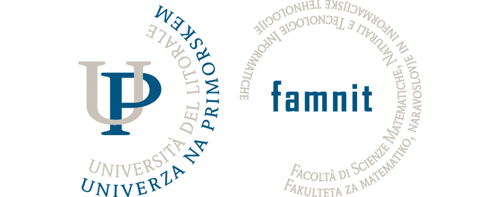

  

# UP FAMNIT - Programming 2 (Functional Programming) - 2023/2024

Professor: dr. Iztok Savnik

Practice assistant: dr. Peter Muršič

## Intro 

The repository serves as a personal archive of all code written during the course of Programming 2 at UP FAMNIT. The code is written in OCAML, using IntelliJ IDEA as the IDE.

**!!!! Code may not be compliable, functional or fully completed. Use/Copy at your own risk, as the code is always submitted to a designated assigment before upload. Bugs may be included !!!!**

## Folder structure

1. Classification based on class type:
    - `class` - Contains code from lectures, that was written during the class.
    - `practice`
      - `lab` - Contains code we wrote during the lab practice.
      
2. Organised code by dates (yyyy-mm-dd).

3. Optionally organised further to maintain a clean structure.

---

This is a personal space, thus contributions or pull requests will (probably) not be accepted.